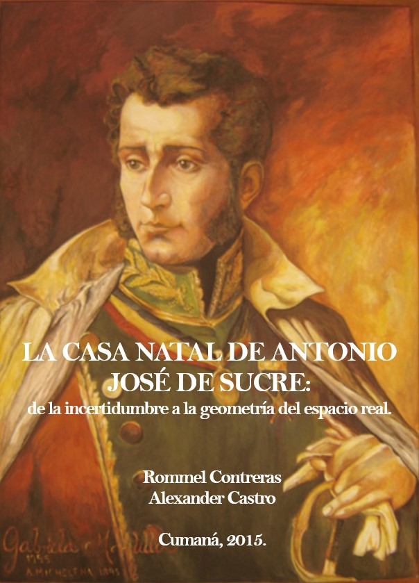
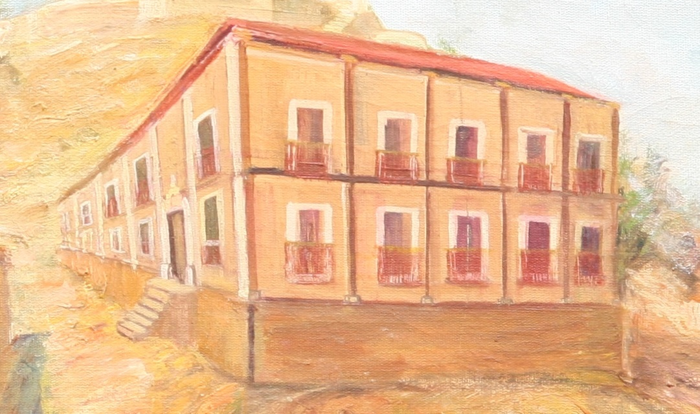

# [LA CASA NATAL DE ANTONIO JOSÉ DE SUCRE](https://rommeljose.github.io/La-Casa-Natal-de-AJS)
## [De la incertidumbre a la geometría del espacio real.](https://rommeljose.github.io/La-Casa-Natal-de-AJS)

#### Por:  Rommel Contreras / Alexander Castro
### Miembros de la Academia de la Geohistoria del Estado Sucre / Venezuela

El libro comprende la verificación documental y cartográfica del nacimiento de Antonio José de Sucre, magno hecho acaecido en una casa a las faldas del cerro San Antonio de la Eminencia de la Ciudad de Cumaná; a la espalda de la iglesia parroquial de Santa Inés y al margen de la antigua Plaza de Armas de la fortaleza de Santa MAría de la Cabeza.

## LICENCIA: 
Se reservan los Derechos de los Autores de esta obra [(ISBN Obra digital: 978-980-12-9997-4)](https://figshare.com/articles/journal_contribution/La_Casa_Natal_de_Antonio_Jos_de_Sucre_De_la_incertidumbre_a_la_geometr_a_del_espacio_real_/5643241). Está permitido y garantizado el uso de este material e información para la copia y distribucción del documento; pero No se permite la alteración del texto ni de las figuras que conforman el libro digital. No otorgamos permisos para ninguna forma de uso comercial: dentro o fuera de la República Bolivariana de Venezuela. Sin embargo, los Gobiernos de las Repúblicas de: VENEZUELA, COLOMBIA, ECUADOR, PERÚ, BOLIVIA Y PANAMÁ; podran hacer uso del material como corresponda a sus necesidades y criterio.

## Colofón

Este libro fue escrito originalmente (2015) en Microsoft Word y exportado al formato PDF. En marzo de 2022, se ha actualizado, con pequeñas correciones, para luego disponerlo en un formato más cómodo para su lectura en la WEB. 

Se codificó utilizando [XML: eXtensible Markup Language](https://es.wikipedia.org/wiki/Extensible_Markup_Language), desarrollado por el [World Wide Web Consortium](https://www.w3c.es/); un meta-lenguaje que permite definir lenguajes de marcas. Para su transcripción se utilizó el editor [Notepad ++](https://notepad-plus-plus.org/);  un editor de código fuente (Software Libre; licencia GPL).

Para lograr su presentación en un formato interactivo y amigable en la WEB, se usó [PreTex](https://pretextbook.org/); una colección de herramientas, que permiten obtener distintas presentaciones a partir de hojas de estilo pre diseñadas; de esta manera el autor se preocupa más por el contenido que por la estructura y estilo de la obra final. Todo ello conforma un vocabulario XML para documentos académicos. Con *PreTex*  se puede describir el contenido y la estructura de un libro de texto, monografía o artículo académico (*PreText* es Software Libre; licencia GPL).

Como "sistema operativo" se utilizó [CygWin](https://cygwin.com), una colección de herramientas GNU -de código abierto- que proporcionan una funcionalidad similar a una distribución de Linux bajo Windows (Software Libre; licencia GPL y LGPL).

###### *Nota: Todas las marcas registradas son las marcas registradas de sus respectivos propietarios.*

<!--
## Proceso de los archivos de código XML (PreText)

`Para ejecutar los comandos de edición PreText (en un entorno CygWin o Linux):`

### Para generar el archivo .txt con el código LaTex:

##### xsltproc --xinclude --stringparam latex.font.size "12pt"   -o ./libro_AJS.txt   ../../mathbook/xsl/pretext-latex.xsl libro_Casa_natal_AJS.xml

#### Para generar el [PDF: LA CASA NATAL DE ANTONIO JOSÉ DE SUCRE](https://figshare.com/ndownloader/files/9831583)

##### pdflatex libro_AJS.txt

#### Para generar los archivos HTML y de imágenes que conforman el libro [WEB: LA CASA NATAL DE ANTONIO JOSÉ DE SUCRE](https://rommeljose.github.io/La-Casa-Natal-de-AJS):

##### xsltproc --xinclude -stringparam publisher  publication-decorative.xml -o ./libro_AJS.txt   ../../mathbook/xsl/pretext-html.xsl ./libro_Casa_natal_AJS.xml

-->